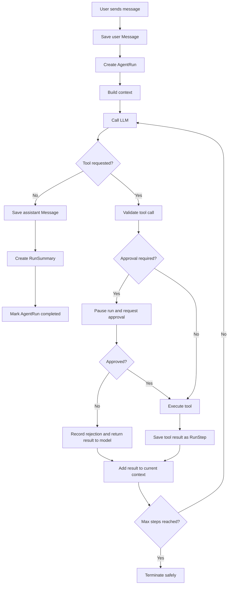

# Agent Runtime Flow

## Purpose

The agent runtime controls how a user request moves through the model, tools, approvals, persistence, and final response.

The runtime is the core custom component of the project.

## High-Level Flow



## 1. Receive User Message

The frontend sends a message associated with a conversation.

The backend:
1. validates the request
2. saves the user-visible message
3. creates a new AgentRun
4. initializes runtime state

Example runtime state:

```text
run_id
conversation_id
trigger_message_id
step_count
status
messages/context
pending_approval
```

## 2. Build Context

The Context Manager assembles what the model should see.

Initial context may include:
- system instructions
- recent user and assistant messages
- relevant summaries from previous runs
- the newest user message

During an active run, exact tool calls and tool results are also added to the context so the model can reason over what just happened.

## 3. Call the Model

The Model Provider sends the context and registered tool schemas to the selected LLM.

The response should resolve into one of two paths:

### Final Response
The model has enough information and returns the answer to the user.

### Tool Call
The model requests one or more available tools.

## 4. Validate the Tool Call

Before executing anything, the runtime checks:
- the tool exists in the registry
- the model is allowed to use it
- arguments match the tool's Pydantic schema
- the run has not exceeded its limits
- approval requirements

Invalid calls are recorded as RunSteps and returned to the model as structured errors when appropriate.

## 5. Handle Approval

Some tools can execute immediately.

Sensitive tools can require explicit human approval.

Example:

```text
refund_order(order_id=123, amount=79.99)
```

The runtime:
1. records the requested tool call
2. marks the run as waiting for approval
3. streams an approval event to the frontend
4. pauses execution
5. resumes after approve/reject input

A rejection is treated as information the model can reason about rather than silently discarding the action.

## 6. Execute the Tool

The Tool Executor invokes the registered Python handler or external API.

It is responsible for:
- executing the tool
- applying timeouts
- catching failures
- retrying allowed transient failures
- converting success or failure into a normalized result

The result is saved as a RunStep.

## 7. Return the Tool Result to the Model

The exact result from the current run is added to model context.

Example:

```text
User: Check order 123.

Assistant tool call:
get_order(order_id=123)

Tool result:
{"status": "lost", "total": 79.99}
```

The runtime then calls the model again.

The model may:
- call another tool
- request approval for another action
- retry a corrected tool call
- return a final answer

## 8. Repeat Until Completion

Each iteration increments the step count.

The runtime must stop when:
- the model returns a final response
- the maximum number of steps is reached
- an unrecoverable error occurs
- a cancellation is requested
- another explicit termination condition is met

## Run Steps

Every meaningful internal action should be persisted.

Initial step types may include:

```text
model_call
tool_call
tool_result
approval_request
approval_result
retry
error
final_response
```

Each RunStep contains:
- run_id
- step_order
- step_type
- JSONB payload
- created_at

## Completion

When the run succeeds:
1. save the final assistant Message
2. create a compact RunSummary
3. mark the AgentRun as completed
4. stream the completion event to the frontend

The RunSummary is intended for future context. The detailed RunSteps remain available for debugging, traces, analytics, and evaluations.

## Failure Handling

A failed run should still leave a complete trace.

The AgentRun should record a terminal status such as:
- completed
- failed
- cancelled
- max_steps_reached

Errors should be captured as structured RunSteps rather than disappearing into application logs only.

## Core Runtime Principle

The LLM proposes actions, but the runtime controls execution.

The model does not directly execute code, call APIs, approve sensitive actions, or decide whether platform limits should be ignored. Those responsibilities belong to the harness.
