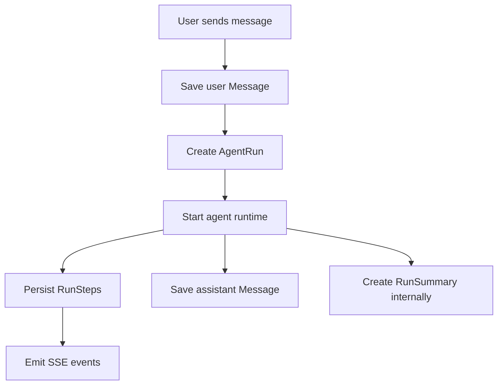
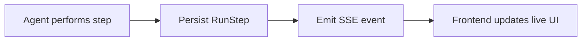

# API Design

This document defines the initial API surface for the AI agent harness. The API separates durable resources stored in PostgreSQL from live runtime events delivered to the frontend.

## Core resources

The frontend needs access to these persistent resources:

- `Conversation`
- `Message`
- `AgentRun`
- `RunStep`
- `Approval`

`RunSummary` is currently an internal context-management artifact and does not need its own public API.

## Design principle

A user message starts an agent run automatically.

A run represents the full attempt to handle one user message. A run does not require a tool call. Even a simple greeting can create a run that consists of one model call and one final response.



## Conversation endpoints

### Create a conversation

```http
POST /conversations
```

Creates a new conversation.

### List conversations

```http
GET /conversations
```

Returns the user's conversations.

### Get a conversation

```http
GET /conversations/{conversation_id}
```

Returns metadata for one conversation.

## Message endpoints

### Send a user message

```http
POST /conversations/{conversation_id}/messages
```

Responsibilities:

1. Save the user message.
2. Create an `AgentRun` linked to that message.
3. Start the agent runtime.
4. Return both the new `message_id` and `run_id`.

The frontend does not directly create assistant messages. Assistant messages are persisted by the backend when the run produces a final response.

Example response:

```json
{
  "message_id": 21,
  "run_id": 8
}
```

### Get conversation messages

```http
GET /conversations/{conversation_id}/messages
```

Returns the user-visible chat history only.

Raw model calls, tool calls, tool results, retries, and other runtime steps are not returned as normal messages.

## AgentRun endpoints

A separate `POST /runs` endpoint is not required because posting a user message automatically creates the run.

### Get run status

```http
GET /runs/{run_id}
```

Returns the current state of the run.

Possible statuses may include:

- `pending`
- `running`
- `waiting_for_approval`
- `completed`
- `failed`

## RunStep endpoints

`RunStep` rows are created internally by the agent runtime. The frontend cannot directly create run steps.

### Get run trace

```http
GET /runs/{run_id}/steps
```

Returns the persisted trace for a run.

Possible step types include:

- `model_call`
- `tool_call`
- `tool_result`
- `approval_request`
- `approval_result`
- `retry`
- `error`
- `final_response`

The exact payload for each step is stored in the `RunStep` JSONB payload field.

## Approval endpoints

Approvals are required for tools marked as approval-gated.

### Get approvals for a run

```http
GET /runs/{run_id}/approvals
```

Returns approvals associated with the run, including pending approvals.

### Approve an action

```http
POST /approvals/{approval_id}/approve
```

Approves the proposed action and allows the runtime to continue.

### Reject an action

```http
POST /approvals/{approval_id}/reject
```

Rejects the proposed action. The runtime resumes with the rejection result available to the model.

## SSE event stream

SSE is a live delivery mechanism and is separate from persisted `RunStep` rows.

```http
GET /runs/{run_id}/events
```

The connection remains open while the run is active and sends events such as:

- `run_started`
- `model_started`
- `tool_call`
- `tool_result`
- `approval_required`
- `response_chunk`
- `run_completed`
- `run_failed`

Example event payload:

```json
{
  "event": "tool_call",
  "run_id": 8,
  "step_id": 43,
  "tool": "get_weather",
  "arguments": {
    "city": "Kelowna"
  }
}
```

## RunStep vs SSE

A `RunStep` is the durable record of what happened.

An SSE event is the real-time notification sent to the frontend while it is happening.

The runtime should generally follow this pattern:



If the user refreshes the page, old SSE events are gone, but the frontend can reconstruct the run by requesting the persisted `RunStep` history.

## Internal-only data

The following do not need public API endpoints in the initial design:

- `RunSummary`
- context state
- summarized memory
- future memory embeddings

These are used internally by the context manager when preparing future model requests.

## Initial API surface

```text
POST /conversations
GET  /conversations
GET  /conversations/{conversation_id}

POST /conversations/{conversation_id}/messages
GET  /conversations/{conversation_id}/messages

GET  /runs/{run_id}
GET  /runs/{run_id}/steps
GET  /runs/{run_id}/events

GET  /runs/{run_id}/approvals
POST /approvals/{approval_id}/approve
POST /approvals/{approval_id}/reject
```

## Backend-generated records

Not every database write requires a public POST endpoint.

The backend/runtime creates these records internally:

- assistant `Message` rows
- `AgentRun` rows after a user message is submitted
- `RunStep` rows
- `RunSummary` rows
- run status changes
- approval request records

This keeps the public API focused on user actions and data retrieval while preserving a detailed internal execution history.
