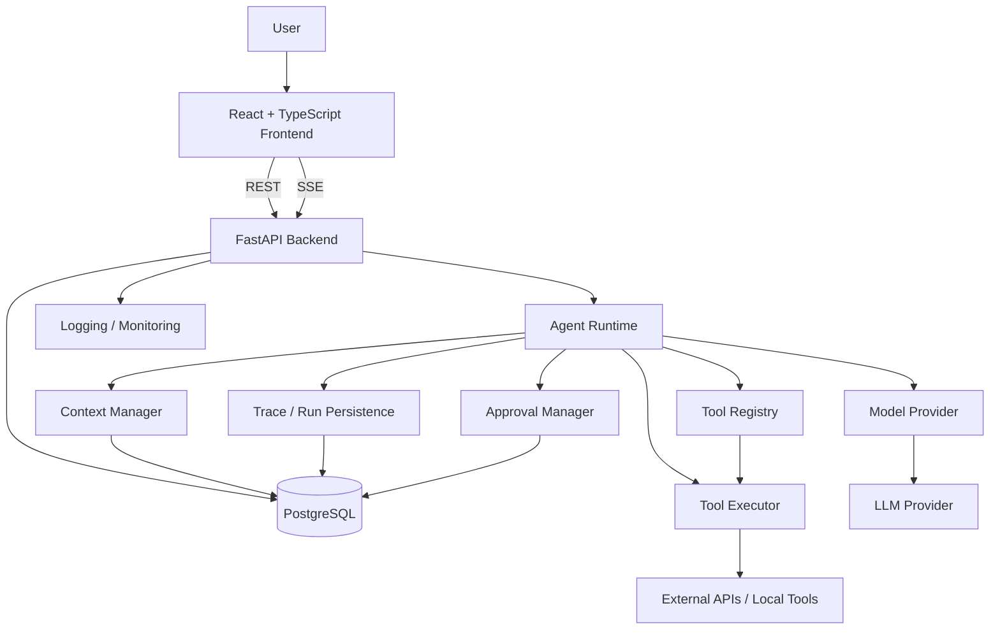
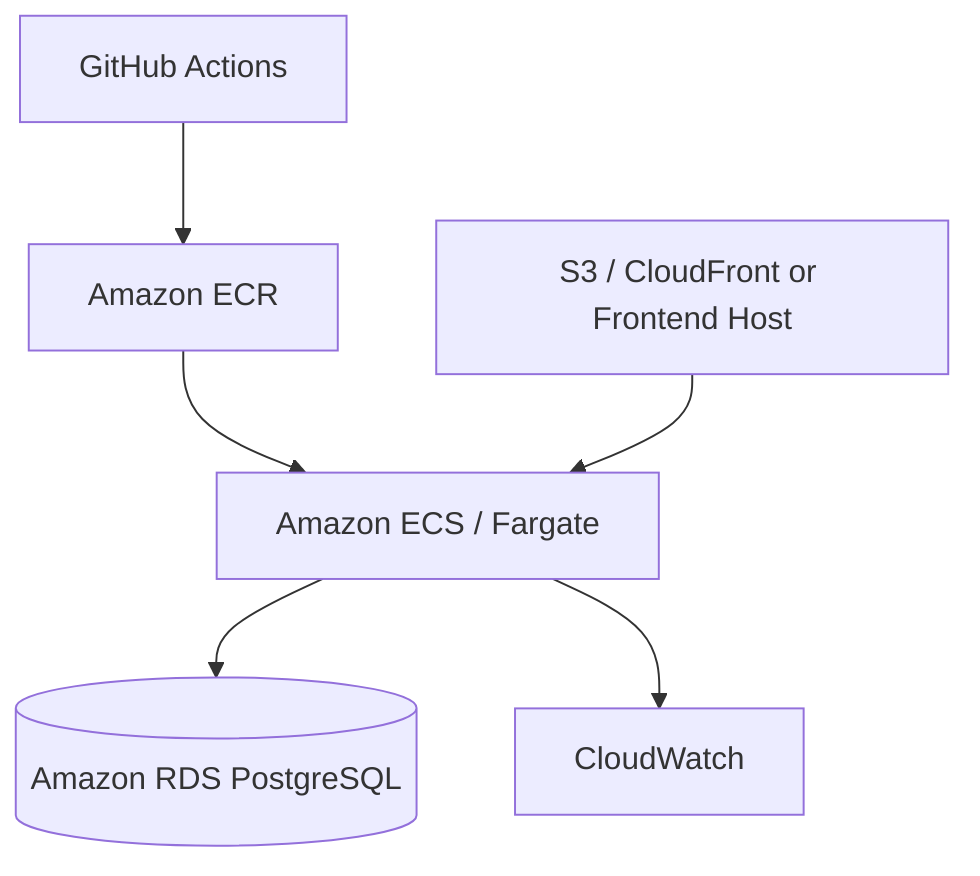

# System Architecture

## Overview

The project is a full-stack AI agent harness that lets a user interact with an AI agent, observe its internal execution steps, approve sensitive actions, and persist conversation and run history.



## Frontend

Technology:
- Vite
- React
- TypeScript
- Tailwind CSS
- Recharts for metrics and run visualizations
- Server-Sent Events for live run updates

Responsibilities:
- Chat interface
- Conversation history
- Agent run timeline
- Tool call and tool result display
- Approval prompts
- Run history
- Basic metrics and status views

## Backend

Technology:
- Python
- FastAPI
- Pydantic
- SQLAlchemy
- psycopg
- Alembic
- httpx
- pytest
- Ruff

Responsibilities:
- REST API endpoints
- Conversation and message persistence
- Agent run creation
- Approval handling
- SSE streaming
- Evaluation endpoints later
- Database access

## Agent Runtime

The agent runtime is custom application code rather than being delegated to a full agent framework.

Suggested modules:

```text
agent/
├── runtime.py
├── tool_registry.py
├── tool_executor.py
├── context_manager.py
├── model_provider.py
├── state.py
├── tracing.py
├── approvals.py
└── errors.py
```

### runtime.py
Controls the model -> tool -> model execution loop and enforces termination rules.

### tool_registry.py
Stores registered tools and their metadata, schemas, handlers, and approval requirements.

### tool_executor.py
Validates arguments, checks permissions and approvals, executes tools, and normalizes results or errors.

### context_manager.py
Builds the model context from recent messages, current-run tool results, summaries, and later relevant memories.

### model_provider.py
Abstracts the selected LLM provider from the rest of the runtime.

### state.py
Represents the active run state, including step count, status, pending approval, and accumulated model context.

### tracing.py
Persists run steps such as model calls, tool calls, tool results, retries, and errors.

### approvals.py
Pauses and resumes runs when a tool requires explicit human approval.

## Database

Primary database:
- PostgreSQL

Initial core tables:
- Conversation
- Message
- AgentRun
- RunStep
- RunSummary

The database stores both user-visible conversation history and internal execution traces.

## Streaming

The backend uses Server-Sent Events to stream run progress to the frontend.

Example events:
- run_started
- model_started
- tool_requested
- tool_completed
- approval_required
- retrying
- run_completed
- run_failed

## Docker

Docker is used for local reproducibility and later deployment.

Initial local setup:
- PostgreSQL container
- backend may run locally during development
- frontend may run with Vite during development

Later:
- frontend container if needed
- backend container
- PostgreSQL container for local development

## CI/CD

CI/CD will be implemented after the core application works locally.

GitHub Actions will eventually:
- run backend tests
- run frontend tests
- run linting and type checks
- build Docker images
- deploy after successful checks

## AWS Deployment

Planned deployment architecture:



Likely AWS services:
- ECR for container images
- ECS/Fargate for FastAPI backend
- RDS for PostgreSQL
- S3/CloudFront for frontend hosting if used
- CloudWatch for logs and monitoring
- Secrets Manager later for secrets

## Design Principle

The project separates normal web application responsibilities from the custom AI runtime so each area remains understandable, testable, and replaceable.
