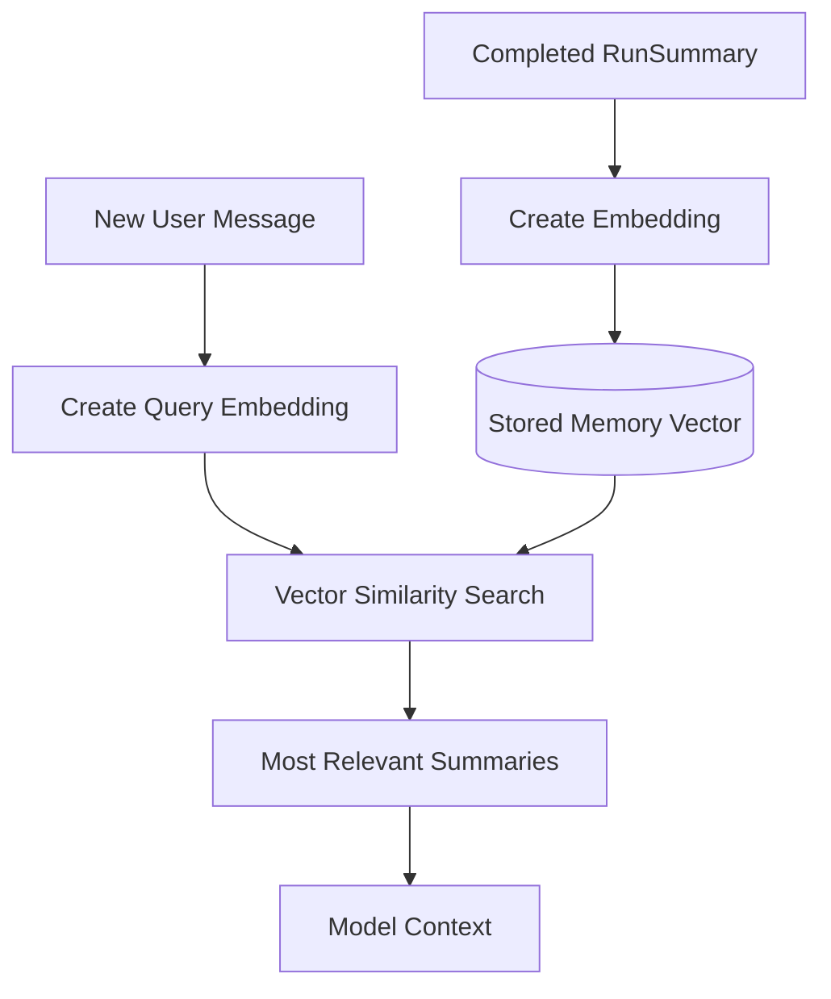

# Context and Memory

## Purpose

The context system decides what information should be sent to the model for each call.

The database may store a large amount of conversation and execution history, but the model should receive only the information that is useful for the current task.

A key design rule for this project is:

> Store more than you send.

## Types of Stored Information

The system stores several different kinds of information:

### Conversation Messages
User-visible chat history:
- user prompts
- assistant responses

Stored in the Message table.

### Current Run Steps
Internal execution details from the active AgentRun:
- model calls
- tool calls
- tool results
- approvals
- errors
- retries

Stored in RunStep.

### Run Summaries
Compact summaries of completed runs.

Stored in RunSummary.

These summaries preserve useful outcomes without replaying every raw internal step in future model calls.

## Current Run Context

During an active run, the model needs precise information about what just happened.

The context should include:
- current user request
- recent conversation messages
- current system instructions
- current-run tool calls
- current-run tool results
- approval outcomes
- relevant runtime errors when the model can recover from them

Example:

```text
User:
Check order 123 and refund it if it is lost.

Assistant tool call:
get_order(order_id=123)

Tool result:
{"status": "lost", "total": 79.99}

Assistant tool call:
refund_order(order_id=123, amount=79.99)
```

Raw current-run tool results are useful because the model may need exact values to decide its next action.

## Future Run Context

When the user sends a later message, the runtime should not automatically replay every previous RunStep.

Instead, context may include:
- recent Message history
- useful RunSummary records
- relevant persistent state
- the new user message

Example:

```text
Previous run summary:
Order 123 was confirmed lost and refunded after user approval.

User:
Can you send them a confirmation email too?
```

This gives the model enough information without including old request IDs, latency values, retries, or unrelated tool output.

## Run Summaries

A RunSummary should capture meaningful facts and outcomes from a completed run.

Good summary content:
- actions completed
- important entities or IDs
- decisions made
- unresolved work
- approval outcomes
- useful state for future turns

Example:

```text
Order 123 was confirmed lost. The user approved a $79.99 refund and the refund completed successfully.
```

Avoid filling summaries with internal observability information such as:
- HTTP request IDs
- exact model latency
- token counts
- internal stack traces

Those remain available in RunStep or application logs.

## Initial Context Strategy

The first implementation should stay simple.

A practical initial strategy:
1. include the system prompt
2. include the last N user/assistant messages
3. include relevant recent RunSummary records
4. include the new user message
5. during the active run, append exact tool calls and tool results

This avoids prematurely building a complex memory engine.

## Context Window Management

As conversations grow, the application must avoid sending unlimited history to the model.

Later strategies may include:
- message trimming
- conversation summarization
- token-budget-aware selection
- relevance-based summary retrieval
- semantic memory retrieval using embeddings

## Semantic Memory

A later feature can use embeddings to retrieve useful past context.

This works similarly to RAG, except the retrieved content is prior agent memory rather than document chunks.



Example stored memories:
- Order 123 was refunded.
- Ticket 82 is waiting for approval.
- The customer changed their contact email.

If the new user message asks about the lost order, semantic retrieval should favor the order-related memory over unrelated previous runs.

## What Should Not Automatically Become Memory

Do not embed or promote every raw RunStep into long-term memory.

Examples of poor memory candidates:
- HTTP 200 responses
- latency values
- request IDs
- temporary retry messages
- low-level tool metadata

Prefer meaningful facts, decisions, outcomes, and unresolved state.

## Determining Relevance

Future versions can use a hybrid approach:

### Deterministic Selection
Always include information such as:
- active task state
- pending approvals
- recent conversation messages
- current-run tool results

### Semantic Retrieval
Use embeddings to retrieve older summaries related to the new request.

### Model-Assisted Selection
The model may later help rank or summarize ambiguous historical context, but it should not be the only mechanism deciding what state is important.

## Persistence vs Context

Persistence and model context are deliberately separate concepts.

```text
Database
Stores complete history

        ↓ Context Manager

Model Context
Contains only information selected for the current call
```

This allows the application to keep detailed traces for debugging and evaluation without polluting every future model request.

## Design Principle

The context manager should preserve enough information for the agent to make correct decisions while minimizing irrelevant history, token usage, and stale state.
