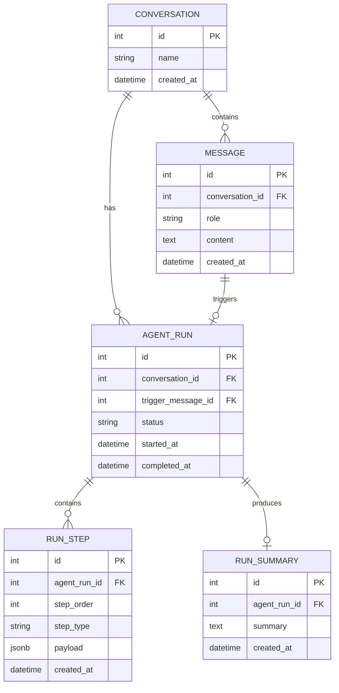

# Database ER Diagram

This document describes the initial database structure for conversations, user-visible messages, agent runs, internal run traces, and compact run summaries used for future context.

## Table Responsibilities

### Conversation
Represents one chat thread. It groups together the user-visible messages and all agent runs that happen within that conversation.

### Message
Stores only the clean conversation shown to the user. This includes user prompts and final assistant responses, but not internal tool calls or raw execution logs.

`role` is expected to contain values such as `user` and `assistant`.

### AgentRun
Represents one execution of the agent runtime. A run is normally triggered by a user message and may contain multiple model calls, tool calls, approvals, retries, and other internal steps before producing the final assistant response.

### RunStep
Stores the internal trace for an agent run. Each row represents one ordered step in the execution.

Possible `step_type` values include:

- `model_call`
- `tool_call`
- `tool_result`
- `approval_request`
- `approval_result`
- `retry`
- `error`
- `final_response`

The `payload` column uses PostgreSQL `JSONB` so each step type can store the data appropriate to that step without requiring separate tables initially.

`step_order` provides deterministic ordering within a run instead of relying only on timestamps.

### RunSummary
Stores a compact summary of what happened during an agent run. The context manager can use these summaries in later prompts instead of replaying every raw `RunStep` from previous runs.

The raw run trace remains stored for debugging, evaluation, and observability, while the summary is intended for efficient conversational context.

## Context Flow

A future model request can be constructed from:

1. Recent user-visible `Message` records.
2. Raw `RunStep` results from the currently active run.
3. Relevant `RunSummary` records from previous runs.
4. The newest user message.

This keeps the full execution history available in the database without unnecessarily filling the model's context window with old raw logs.
