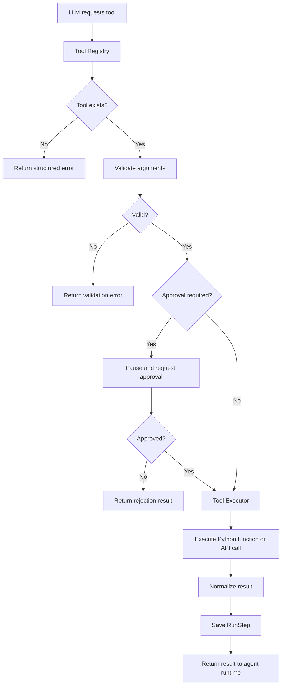

# Tool System

## Purpose

The tool system lets the model request actions while keeping execution under application control.

The model can propose a tool call, but the harness decides whether that tool exists, whether the arguments are valid, whether approval is required, and whether execution is allowed.

## High-Level Flow



## Tool Definition

Each tool should have:
- name
- description
- input schema
- Python handler
- approval requirement
- optional permission metadata

Example conceptual definition:

```python
@tool(
    name="get_weather",
    description="Get current weather for a city",
    requires_approval=False,
)
def get_weather(city: str):
    ...
```

The exact decorator API can be designed later.

## Tool Registry

The Tool Registry is the central source of truth for available tools.

Responsibilities:
- register tools
- prevent duplicate names
- expose tool metadata to the model
- return the correct handler for execution
- expose approval and permission requirements

Conceptually:

```text
get_weather
├── description
├── input_schema
├── handler
└── requires_approval = false

refund_order
├── description
├── input_schema
├── handler
└── requires_approval = true
```

## Input Schemas

Pydantic should be used to define and validate tool arguments.

Example:

```python
class GetOrderInput(BaseModel):
    order_id: int
```

The schema serves two purposes:
1. tell the model what arguments the tool accepts
2. validate the model's generated arguments before execution

## Tool Executor

The Tool Executor receives a validated tool request and performs the actual action.

Responsibilities:
- look up the tool handler
- check permissions
- check approval status
- apply timeouts
- execute the handler
- catch exceptions
- retry transient failures when allowed
- normalize results
- record execution data

## Tool Result Format

Tools may naturally return different kinds of data, but the harness should convert results into a predictable internal format.

Example:

```json
{
  "status": "success",
  "data": {
    "order_id": 123,
    "delivery_status": "lost"
  },
  "error": null
}
```

Failure example:

```json
{
  "status": "error",
  "data": null,
  "error": {
    "type": "timeout",
    "message": "Order service did not respond in time"
  }
}
```

This makes it easier for the runtime and model to reason about tool outcomes consistently.

## Approval-Required Tools

Sensitive or mutating tools can require explicit user approval.

Examples:
- refund_order
- delete_record
- send_email
- modify_account

The tool definition should carry this metadata so the runtime does not rely on the model to decide whether approval is needed.

Example flow:

```text
Agent requests refund_order
        ↓
Tool metadata says approval required
        ↓
Run pauses
        ↓
Frontend displays proposed action
        ↓
User approves or rejects
        ↓
Run resumes
```

## Permissions and Guardrails

The harness should enforce rules outside the model.

Initial guardrails:
- only registered tools can execute
- tool input must match the schema
- approval-required tools cannot execute without approval
- execution stops after the maximum step count
- tool failures are returned as structured results

Later guardrails may include:
- per-agent tool permissions
- per-user permissions
- rate limits
- cost limits
- environment restrictions

## Tool Calls as Run Steps

Tool execution should be persisted in RunStep.

Example tool call payload:

```json
{
  "tool_name": "get_order",
  "arguments": {
    "order_id": 123
  }
}
```

Example tool result payload:

```json
{
  "tool_name": "get_order",
  "status": "success",
  "result": {
    "order_id": 123,
    "delivery_status": "lost"
  }
}
```

For the initial implementation, separate ToolCall and ToolResult database tables are not required. RunStep with JSONB payloads keeps the design flexible and simple.

## Errors and Retries

Not every failure should be handled the same way.

Possible categories:
- validation error
- permission error
- rejected approval
- timeout
- transient external API failure
- permanent external API failure
- unexpected internal error

Transient failures may be retried according to a small configured policy.

Permanent or validation failures should generally be returned to the model as structured errors so it can decide whether to recover or stop.

## External vs Local Tools

A tool handler may:
- run a local Python function
- query the database
- call an external REST API
- call another internal service

The runtime should not need to care which implementation a tool uses.

```text
Agent Runtime
      ↓
Tool Registry
      ↓
Tool Executor
      ↓
┌────────────┬────────────┬─────────────┐
Python Func  Database     External API
```

## Tool Descriptions

Tool descriptions should be explicit enough for the model to understand:
- what the tool does
- when it should be used
- what its arguments mean
- important limitations

Poor tool descriptions can lead to incorrect tool selection even when the runtime itself is working correctly.

## Initial Tool Set

The project only needs a few tools at first to prove the runtime works.

A useful demonstration set could include:
- a read-only lookup tool
- a simple external API tool
- a mutating tool that requires approval

The goal is to exercise different runtime paths rather than build a large tool catalog.

## Design Principle

The model chooses which registered action it wants to attempt. The harness remains responsible for validating, authorizing, executing, recording, and controlling that action.
